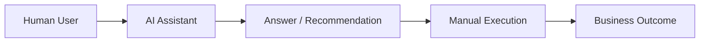
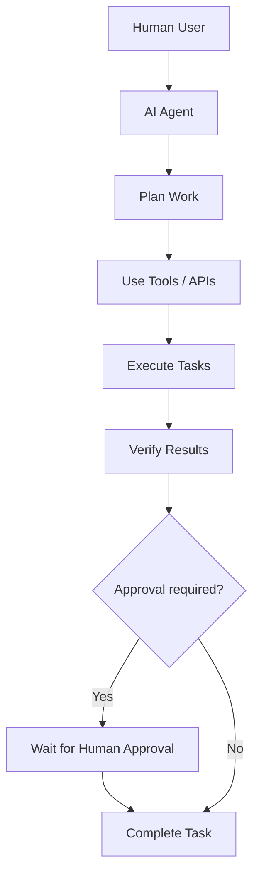
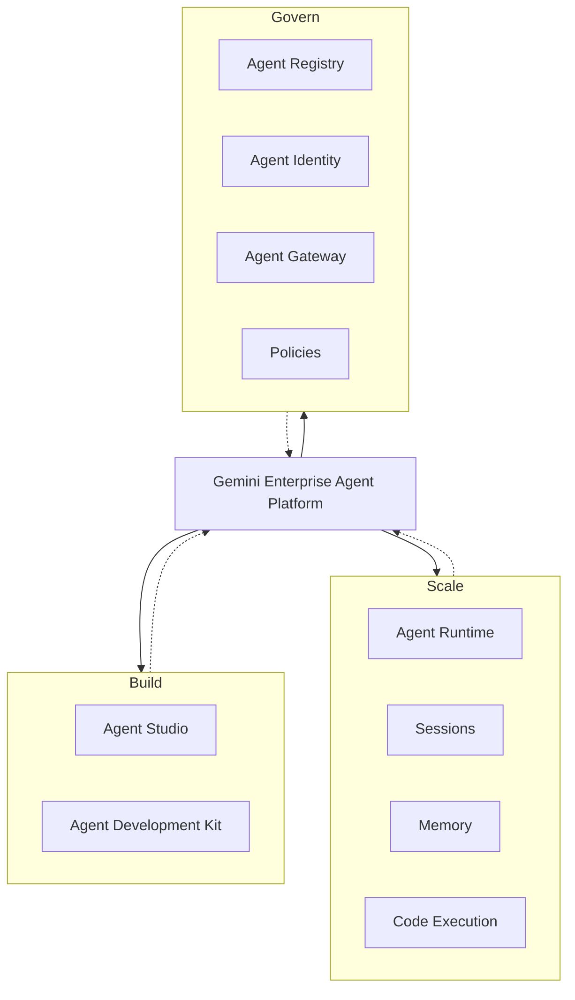
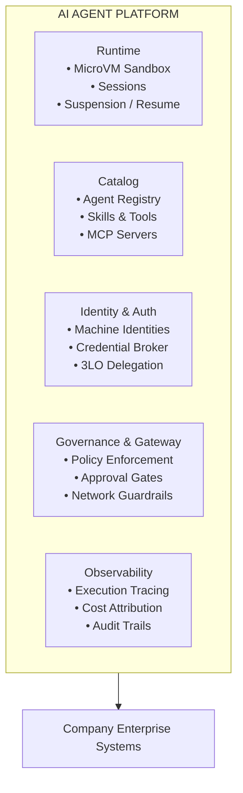
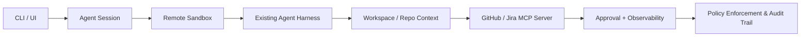

# RFC: Enterprise AI Agent Platform Architecture & Strategy

- **Author:** Engineering & Technology Leadership
- **Status:** Draft / Proposed for Review
- **Date:** October 2026
- **Target Audience:** Architecture Review Board, Engineering Leadership, Platform Teams

---

## 1. Objective & Background

### 1.1 Executive Summary
AI is rapidly shifting from interactive chat assistants that help humans perform individual actions toward autonomous agents capable of independently executing multi-step workflows. This transition is already clearly visible in developer workflows: coding agents (e.g., Claude Code, OpenAI Codex, Google Jules) can inspect repositories, modify code, run tests, work asynchronously, and propose changes for human review.

The primary engineering challenge is no longer model capability; it is providing a robust, enterprise-grade infrastructure layer that allows agents to safely:
* Execute work within isolated, secure environments;
* Access company systems and standard tools consistently;
* Operate under proper machine identities and role-based permissions;
* Retain execution state across long-running, multi-day tasks;
* Register, discover, and reuse capabilities dynamically;
* Operate autonomously on schedules or event triggers;
* Enforce human-in-the-loop approvals for sensitive modifications;
* Provide comprehensive observability into actions, costs, and outcomes.

This mirrors the strategic direction of major cloud platforms (such as Google’s Gemini Enterprise Agent Platform and OpenAI's Agents API), which provide modular capabilities across runtimes, registries, identity management, gateways, and governance.

### 1.2 Core Proposal (Hypothesis)
We propose designing and building a company-wide **AI Agent Platform (AICP)** that provides shared, standardized infrastructure for teams to build, run, discover, and govern AI agents.

This platform should serve as the enterprise substrate for agent execution, identity, orchestration, and policy enforcement. While developer workflows are the natural initial beachhead, the capability must be designed as a horizontal platform for Product, Operations, Security, Finance, HR, and Support functions over time.

> The platform should not replace foundation models or agent harnesses; it should provide the secure, observable, and governable runtime layer that makes autonomous execution enterprise-ready.

---

## 2. From AI Assistants to Autonomous Agents

The historical interaction model relied entirely on manual invocation. In that model, the user asks for help and then performs the work themselves. The emerging model is different: the system plans, invokes tools, verifies outcomes, and can continue execution with or without human approval depending on the task and policy.

The emerging agentic model decouples execution from the user:

An agent performing real operational work requires underlying platform primitives that go far beyond basic text generation:

- Compute sandboxes and microVM isolation
- Persistent session state management
- Standardized tool registries (MCP)
- Cryptographic machine identities
- Credential brokers and delegated auth (3LO)
- Network isolation and policy enforcement
- Audit trails and agent-native observability
- Asynchronous scheduling and recovery frameworks

---

## 3. Industry Landscape & Reference Architecture

Our cross-industry research (covering Google Gemini Enterprise Agent Platform, OpenAI Codex/Agents API, and Anthropic Claude Code) shows a strong convergence around modular platform primitives.

### 3.1 Google Reference Architecture
Google’s Agent Platform cleanly separates concerns across the agent lifecycle:

* **Agent Registry:** Centralized catalog for agents, MCP servers, tools, skills, and endpoints supporting dynamic discovery.
* **Agent Identity & Auth:** Managed identities combined with an Auth Manager supporting two distinct patterns:
  * *Agent-Owned (2LO):* $\text{Agent} \rightarrow \text{API Key / OAuth} \rightarrow \text{External System}$
  * *User-Delegated (3LO):* $\text{Human User} \rightarrow \text{Consent / OAuth} \rightarrow \text{Auth Manager} \rightarrow \text{Token Exchange} \rightarrow \text{Agent Acting on User Behalf}$
* **Agent Substrate:** Separates logical actors and state from ephemeral physical worker nodes, enabling efficient suspend/resume mechanics for large agent fleets.

---

## 4. Proposed Architecture: Core Platform Primitives

We propose organizing the platform into five core capability pillars:

---

## 5. Architectural Separation: Logical Agents vs. Physical Workers

To optimize cost and resource scaling, we will adopt a decoupled worker model that separates durable agent state from short-lived compute capacity:

- **Logical Agent State:** Persisted in durable storage (Memory / State Store) independent of compute instances.
- **Ephemeral Compute:** Scheduled execution maps logical agents onto ephemeral worker pools and microVM sandboxes on demand.
- **Suspend & Resume:** Idle or approval-pending agents are snapshotted and evicted from compute nodes, reclaiming resources while preserving execution state.

---

## 6. Initial Beachhead: Engineering Workflows

Engineering is the proposed initial domain due to high AI adoption and structured pipelines:

1. **Autonomous Coding:** Ticket → Coding Agent → Repo Analysis → Implementation → Validation → Tests → PR → Human Review

2. **Incident Investigation:** Alert → Incident Agent → Log/Metric Inspection → Deploy Check → Root Cause Report

3. **Release Automation:** Release Request → Validation → Tests → Policy Check → Approval → Deploy & Monitor

---

## 7. Build vs. Reuse Strategy

| We Should Provide (Platform Layer) | We Should Integrate With (Ecosystem) |
| :--- | :--- |
| * Agent lifecycle & runtime management | * **Foundation Models:** Claude, GPT/Codex, Gemini |
| * Session state & workspace isolation | * **Agent Harnesses:** Claude Code, Codex, Cursor, ADK |
| * Agent catalog & MCP server registry | * **Enterprise Tools:** GitHub, Jira, Confluence, Slack, AWS, K8s |
| * Enterprise identity & 3LO credential broker | |
| * Governance gateway, policies, & approval gates | |
| * Agent-native observability & cost tracking | |

This keeps the platform model- and harness-agnostic, positioning it as the enterprise governance and security wrapper around autonomous AI.

---

## 8. Proposed Pilot & Validation Strategy

Rather than building a monolithic platform upfront, we propose a focused engineering pilot to validate core primitives:

### Success Metrics for the Pilot
1. Do developers successfully delegate multi-step engineering tasks to autonomous agents?
2. Does remote sandbox isolation eliminate local setup friction and reduce security risk?
3. Does centralized identity and user-delegated auth (3LO) work seamlessly with enterprise tools?
4. Can we accurately measure cost, reliability, and operational outcomes per agent task?

This pilot should validate the minimum viable platform layer before broader rollout across other enterprise functions.