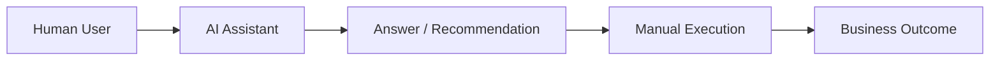
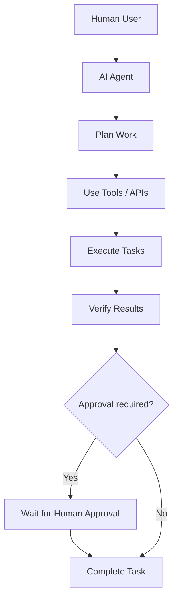
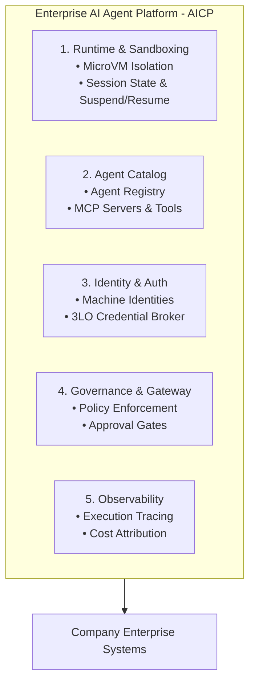
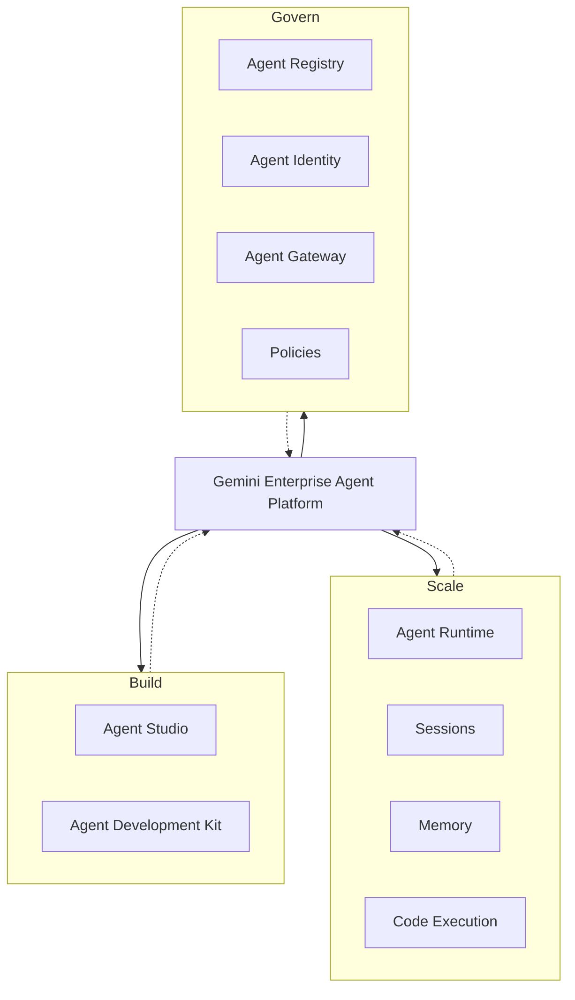
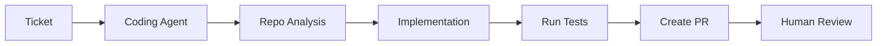
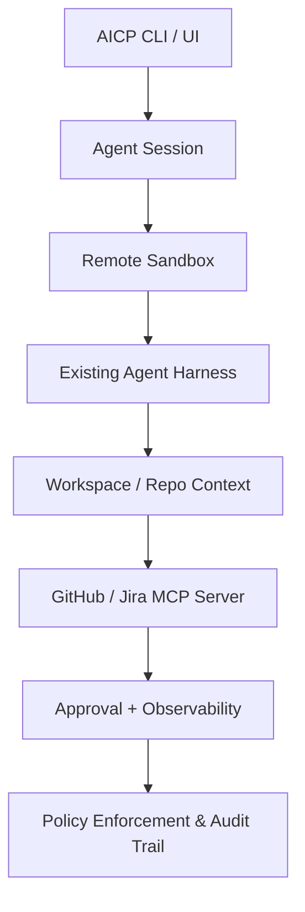

# RFC: Enterprise AI Agent Platform (AICP) Architecture & Strategy

- **Author:** Engineering & Technology Leadership
- **Status:** Proposed / Under Review
- **Date:** October 2026
- **Target Audience:** Architecture Review Board, Platform Engineering, Technology Leadership

---

## 1. Overview & Problem Statement

### 1.1 Context
AI is rapidly shifting from interactive chat assistants that help humans perform individual actions toward autonomous agents capable of independently executing multi-step workflows. This transition is already clearly visible in developer workflows: coding agents (e.g., Claude Code, OpenAI Codex, Google Jules) can inspect repositories, modify code, run tests, work asynchronously, and propose changes for human review.

### 1.2 Problem Statement
While individual teams are adopting AI coding tools and assistants, the organization lacks a unified platform layer. Currently, teams are independently solving foundational infrastructure challenges:

- **Fragmented Tooling:** Multiple teams building bespoke integrations for GitHub, Jira, and Slack.
- **Security & Auth Gaps:** Uncontrolled API keys, lack of proper machine identities, and missing user-delegated authorization (3LO).
- **Isolation Risks:** Running untrusted agentic code and shell commands without standardized microVM sandboxing.
- **Cost & State Inefficiency:** Inability to persist, suspend, and resume long-running agent sessions across durable storage and ephemeral workers.

### 1.3 Goals

- Provide a standardized, secure, enterprise-wide platform for building, running, and governing AI agents.
- Establish core primitives: runtime/sandboxing, catalog, identity/auth, governance, and observability.
- Start with an engineering beachhead (coding, incident investigation, release automation) before expanding horizontally across Product, Operations, Security, and Finance.

### 1.4 Non-Goals

- Rebuilding foundational LLM models; we will integrate with Claude, GPT/Codex, and Gemini.
- Replacing existing developer harnesses; we will integrate with Claude Code, Cursor, and ADK.

### 1.5 Core Proposal (Hypothesis)
We propose designing and building a company-wide **AI Agent Platform (AICP)** that provides shared, standardized infrastructure for teams to build, run, discover, and govern AI agents.

This platform should serve as the enterprise substrate for agent execution, identity, orchestration, and policy enforcement. While developer workflows are the natural initial beachhead, the capability must be designed as a horizontal platform for Product, Operations, Security, Finance, HR, and Support functions over time.

> The platform should not replace foundation models or agent harnesses; it should provide the secure, observable, and governable runtime layer that makes autonomous execution enterprise-ready.

---

## 2. From AI Assistants to Autonomous Agents

The historical interaction model relied entirely on manual invocation. In that model, the user asks for help and then performs the work themselves. The emerging model is different: the system plans, invokes tools, verifies outcomes, and can continue execution with or without human approval depending on the task and policy.

The emerging agentic model decouples execution from the user:

An agent performing real operational work requires underlying platform primitives that go far beyond basic text generation:

- Compute sandboxes and microVM isolation
- Persistent session state management
- Standardized tool registries (MCP)
- Cryptographic machine identities
- Credential brokers and delegated auth (3LO)
- Network isolation and policy enforcement
- Audit trails and agent-native observability
- Asynchronous scheduling and recovery frameworks

---

## 3. Proposed Architecture & Core Primitives

The platform is architected around five capability pillars inspired by modern hyperscale agent substrates (such as Google’s Gemini Enterprise Agent Platform and OpenAI’s Agents API):

### 3.1 Decoupled Execution (Logical Agents vs. Physical Workers)

To optimize compute cost and scaling, we separate logical agent state from execution workers:

- **Logical Agent State:** Persisted in durable storage (Memory / State Store) independent of compute instances.
- **Ephemeral Compute:** Scheduled execution maps logical agents onto ephemeral worker pools and microVM sandboxes on demand.
- **Suspend & Resume:** Idle or approval-pending agents are snapshotted and evicted from compute nodes, reclaiming resources while preserving execution state.

### 3.2 Authentication Patterns: Agent-Owned vs. User-Delegated

The platform secures enterprise integrations through two authorization flows:

1. **Agent-Owned (2LO):** Agent → API Key / OAuth → External System
2. **User-Delegated (3LO):** Human User → Consent / OAuth → Platform Auth Manager → Token Exchange → Agent Acting on User Behalf → Enterprise Tool

### 3.3 Google Reference Architecture
Google’s Agent Platform cleanly separates concerns across the agent lifecycle:

* **Agent Registry:** Centralized catalog for agents, MCP servers, tools, skills, and endpoints supporting dynamic discovery.
* **Agent Identity & Auth:** Managed identities combined with an Auth Manager supporting two distinct patterns:
  * *Agent-Owned (2LO):* $\text{Agent} \rightarrow \text{API Key / OAuth} \rightarrow \text{External System}$
  * *User-Delegated (3LO):* $\text{Human User} \rightarrow \text{Consent / OAuth} \rightarrow \text{Auth Manager} \rightarrow \text{Token Exchange} \rightarrow \text{Agent Acting on User Behalf}$
* **Agent Substrate:** Separates logical actors and state from ephemeral physical worker nodes, enabling efficient suspend/resume mechanics for large agent fleets.

---

## 4. Initial Beachhead: Engineering Workflows

Engineering serves as the initial deployment domain due to high AI adoption and structured pipelines:

- **Autonomous Coding:** Ticket → Coding Agent → Repo Analysis → Implementation → Tests → PR → Human Review
- **Incident Investigation:** Alert → Incident Agent → Log/Metric Inspection → Deploy Check → Root Cause Report
- **Release Automation:** Release Request → Validation → Tests → Policy Check → Approval → Deploy & Monitor

---

## 5. Build vs. Reuse Strategy

| We Should Provide (Platform Layer) | We Should Integrate With (Ecosystem) |
| :--- | :--- |
| * Agent lifecycle & runtime management | * **Foundation Models:** Claude, GPT/Codex, Gemini |
| * Session state & workspace isolation | * **Agent Harnesses:** Claude Code, Codex, Cursor, ADK |
| * Agent catalog & MCP server registry | * **Enterprise Tools:** GitHub, Jira, Confluence, Slack, AWS, K8s |
| * Enterprise identity & 3LO credential broker | |
| * Governance gateway, policies, & approval gates | |
| * Agent-native observability & cost tracking | |

This keeps the platform model- and harness-agnostic, positioning it as the enterprise governance and security wrapper around autonomous AI.

---

## 6. Rollout & Validation Strategy (Pilot Phase)

Rather than building a monolithic platform upfront, we propose a focused engineering pilot to validate core primitives:

### 6.1 Success Metrics for the Pilot
1. **Developer Productivity:** Measure time saved on multi-step engineering and PR creation tasks.
2. **Security & Compliance:** Validate that remote microVM sandboxing and 3LO credential delegation eliminate credential leaks.
3. **Operational Reliability:** Evaluate execution success rates and compute resource reclamation via suspend/resume mechanics.

This pilot should validate the minimum viable platform layer before broader rollout across other enterprise functions.